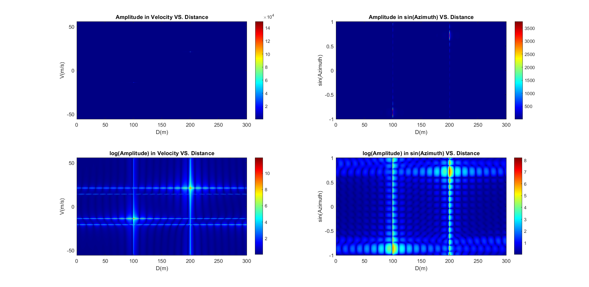
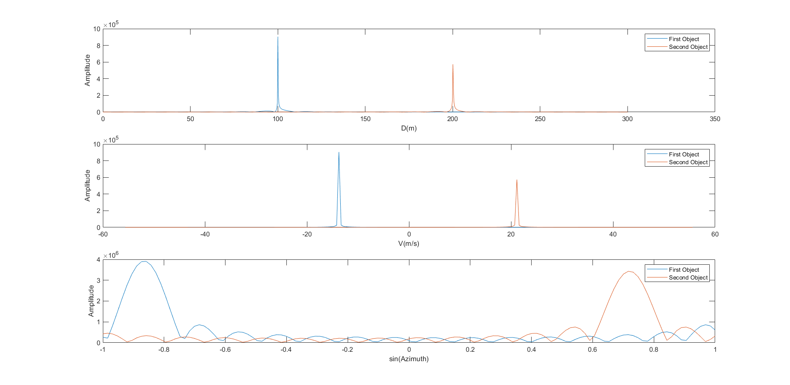
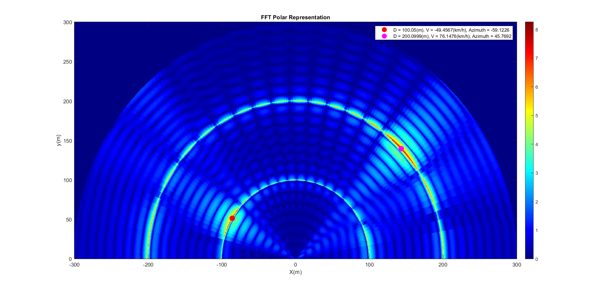

# FMCW_Radar_Ake

  

## Introduction to Frequency-modulated continuous-wave radar (FM-CW)
FMCW is a short-range measuring radar set that operates in real-time and is suited for surveillance applications in transport systems. The transceiver in this system operates in X-band, with a single transmitter and multiple receivers. The signal processing chain includes region of interest selection, multidimensional fast Fourier transform, peak detection[[1]](https://ieeexplore.ieee.org/document/7803613).

## Implimentation Steps
1. In The first step I define the parameters below:
    - Distance Resulotion = 0.3(m)
    - Maximum Distance = 300(m)
    - Maximum Speed = 200(km/h)
    - Speed Resulotion = 1.56(km/h)
    - Speed of light in air
    - Number of Sensors = 16
    - Observation period = $34.56*10^{-3}$
    - carrier frequency = $10^{10}$
2. And calculating this parameters.
    - bandwidth of LMCW signal used (in each chirp)
    - number of chirps
    - time length of each chirp
    - modulation index of chirps (bandwidth / time length of each chirp)
    - max beat frequency
    - sampling rate (sampling frequency), sampling period
    - length of each chirp in samples
3. Then I Produce the signal cube by using $y_{l,k}$ formula

$$y_{l,k}[n] = cos(2\pi(2\frac{BW.d_m}{T_{chirp}c}nT_s+2\frac{v_m}{\lambda_{carrier}}(l-1)T_{chirp}+\frac{d_ssin(\theta_m)}{\lambda_carrier}(k-1)))$$

$$0\le n\le \lfloor{\frac{T_{chirp}}{T_s}}\rfloor-1,1\le l \le N_{chirp},1 \le k \le N_{antennas}$$

4. Adding two $y_{lk}$ signals of two Objects
5. Calculating the 3d $fft$ with $fftshift$ of $y_{l,k}$ by zero padding to the next power of two
6. Finding the two maximums for future plotting of 1D ffts
7. Calculating the 3d $fft$ with $fftshift$ of $y_{l,k}$ again by zero-padding to the next power of two and also adding 8 times more zero-padding to the third dimension to increase the accuracy of finding the maximum
8. Plotting the 2d ffts with and without getting the logarithm of amplitude and it's because the details become more visible by getting the log.
9. Plotting the 1d ffts near the occurrence of each peak and finding the exact maximums.
10. Changing the $log(Amplitude)$ in $sin(azimuth)$ vs. $Distance$ and draw it in a polar way.
11. Showing the found points by plotting on top of the previous figure.

## Results

 
  
  
 
  

